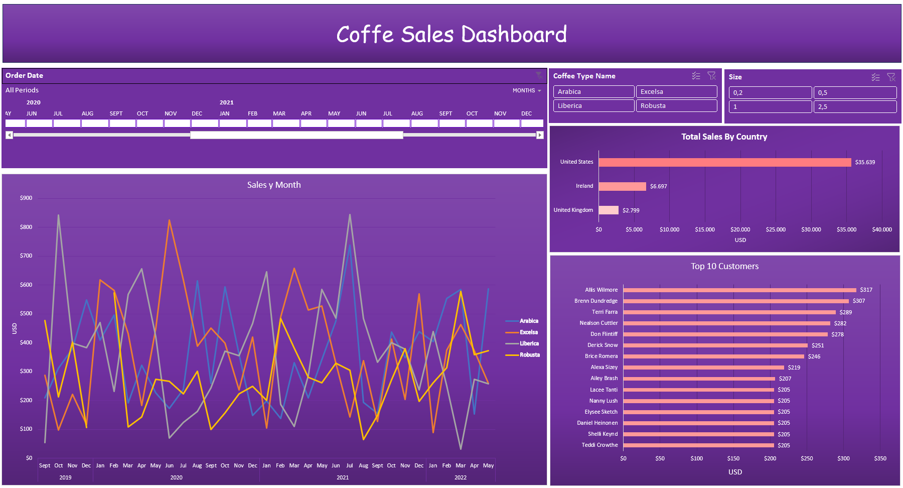

# ☕ Coffee Sales Dashboard

---

## 📊 Overview

The **Coffee Sales Dashboard** is a dynamic Excel report that lets you slice and dice global coffee order data to uncover trends in revenue, customer behavior, and product performance. With interactive Timeline and Slicer controls, you can filter by date, country, coffee type, and size to answer questions like:

- Which country generated the most sales this quarter?  
- Who are our top customers and how much have they spent?  
- What times of day see the highest order volume?  

---

## 🖼️ Dashboard Snapshots

## 📁 Project Structure

- `excel_dashboard/`: Contains the Excel file with the full interactive dashboard.
- `data/`: Sample dataset used for analysis.
- `assets/`: Contains dashboard screenshots.
- `README.md`: Project documentation.

## 🛠 Tools & Techniques

- **Microsoft Excel (2016+)**  
  - **Data Model & Relationships** across Orders, Customers, and Products tables  
  - **Power Query** to import and clean raw CSV data  
  - **PivotTables** driving all summary metrics  
  - **Slicers & Timeline** for on-sheet interactivity (Country, Coffee Type, Size, Order Date)  
  - **XLOOKUP** and **INDEX–MATCH** for custom lookup calculations  
  - **Conditional Formatting** to highlight top/bottom performers  

---

## 🎯 Key Insights

- **Top Country by Revenue:**  
  - **United States**: \$35,639 total sales  
- **Top Customer:**  
  - **Allis Wilmore**: \$317 in orders  
- **Peak Ordering Times:**  
  - Highest volume between **8 AM–10 AM** and **5 PM–7 PM** local time  
- **Popular Coffee Types:**  
  - Arabica drives the largest share of orders, followed by Robusta  

---

## 🚀 How to Use

1. Download or Clone the Excel file from the `excel_dashboard/` folder.
2. Open with Excel (2016+ recommended for full compatibility).
3. Interact with slicers and the timeline to explore data dynamically.
